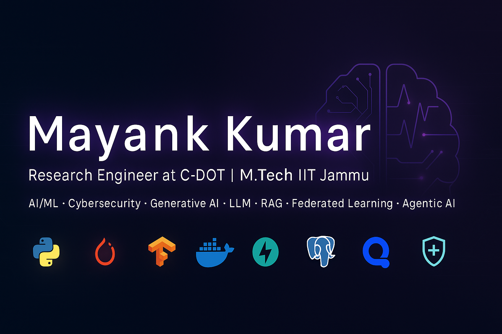

<!-- Banner (optional: replace with your own image or a Canva design) -->

<h1 align="center">Hi 👋, I'm Mayank Kumar</h1>
<h3 align="center">🚀 Research Engineer @ C-DOT | 🎓 M.Tech (CSE), IIT Jammu</h3>

---

## ✨ About Me
- 🔐 Working on **real-time anomaly detection & UEBA systems** at **C-DOT**  
- 🧠 Research in **Federated Learning Security, Adversarial Attacks & Phishing Detection**  
- 🤖 Passionate about **AI/ML, Cybersecurity, Generative AI, Agentic AI**  
- 📚 **Publications** in ICONIP & SINCOF on Federated Learning resilience and phishing defense  
- 🌱 Exploring **LangChain, LangGraph, and RAG** for secure AI applications  

---

## 🛠️ Tech Stack

---

## 📌 Featured Projects

### 🔎 [IIT Mandi Internship](https://github.com/mayank1303/IIT_Mandi_Internship)  
Analysis of separable vs non-separable datasets (image & tabular) with ML experiments.  

### 🐦 [Live Prediction of Bird Species via Audio](https://github.com/mayank1303/Live-Prediction-of-Bird-Species-via-Audio)  
Flask app for real-time bird species prediction using audio classification.  

### 🌊 [Underwater Object Detection](https://github.com/mayank1303/Underwater-Object-Detection)  
Encoder-decoder pipeline with meta-learning for robust underwater detection.  

### 📨 [Phishing Email Cognitive Bias](https://github.com/mayank1303/Phishing-Email-Cognitive-Bias)  
Studying cognitive biases in phishing detection using ML/DL + GloVe embeddings.  

### 🔐 [Federated Learning Attacks](https://github.com/mayank1303/Federated-Learning-Attacks)  
Research on backdoor & adversarial attacks in federated and split learning.  

---

## 📝 Publications
- **ICONIP 2022** — *Cognitive Biases in Phishing Emails & Human Decision-Making*  
- **SINCOF 2023** — *BATFL: Battling Backdoor Attacks in Federated Learning*  
- **SINCOF 2023** — *RAFT: Evaluating Federated Learning Resilience Against Threats*  

---

## 🎓 Certifications
- Agentic AI with LangChain & LangGraph — IBM (Coursera)  
- Build RAG Applications — IBM (Coursera)  
- Neural Networks & Deep Learning — DeepLearning.AI  
- Linear Algebra for ML & Data Science — DeepLearning.AI  

---

## 📊 GitHub Stats

  
  

---

## 📫 Connect with Me
- 💼 [LinkedIn](https://in.linkedin.com/in/mayankkumariitj)  
- 🧑‍💻 [GitHub](https://github.com/mayank1303)  
- 📚 [Google Scholar](https://scholar.google.com/citations?hl=en&user=FFjWFqgAAAAJ)  
- ✉️ **Email:** mayankkumar1303@gmail.com  

---

⭐️ *“Exploring the intersection of AI and Security to build robust, intelligent systems.”*
